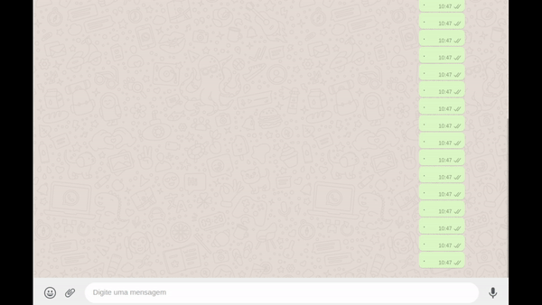
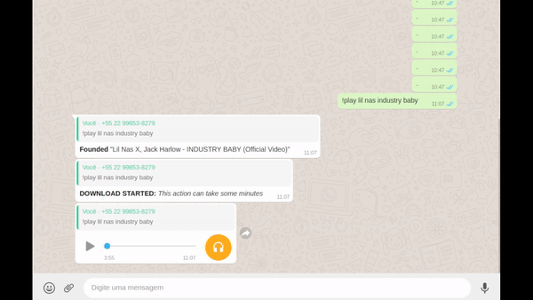

<h1 align="center">
  
</h1>

<h3 align="center">
  WhatsApp Music Bot v3
</h3>
<h6 align="center"><i>now for Multidevices!</i></h6>

<p align="center">
  

  

  
  <a href="https://github.com/mlg404/whatsapp-music-bot/commits/master">
    
  </a>

  <a href="https://github.com/mlg404/whatsapp-music-bot/issues">
    
  </a>

  
</p>

<p align="center">
  <a href="#rocket-info">Info</a>&nbsp;&nbsp;&nbsp;|&nbsp;&nbsp;&nbsp;
  <a href="#computer-technologies">Technologies</a>&nbsp;&nbsp;&nbsp;|&nbsp;&nbsp;&nbsp;
  <a href="#information_source-how-to">How to</a>&nbsp;&nbsp;&nbsp;|&nbsp;&nbsp;&nbsp;
  <a href="#mag_right-functionalities">Functionalities</a>&nbsp;&nbsp;&nbsp;|&nbsp;&nbsp;&nbsp;
  <a href="#busts_in_silhouette-contribute">Contribute</a>&nbsp;&nbsp;&nbsp;|&nbsp;&nbsp;&nbsp;
  <a href="#memo-license">License</a>
</p>

<p align="center" style="display: flex; flex-direction: column; align-items: center; justify-content:center;">
  
  
</p>

## :rocket: Info

Your whatsapp becomes a music bot!. You can send music's to your friend's private conversation or in your gropus just sending `!play SONG_NAME` where SONG_NAME is the name of the song you are looking for!

<strong>WARNING:</strong> this bot is not hosted. You need to host it by yourself

## :computer: Technologies

This project was developed following this technologies:

- [ytdl](https://www.npmjs.com/package/ytdl-core)
- [eslint](https://eslint.org/)
- [ffmpeg](https://ffmpeg.org/)
- [Prettier](https://prettier.io/)
- [Node.js](https://nodejs.org/en/)
- [VS Code][vc]
- [Typescript](https://www.typescriptlang.org/)
- [YouTube Search](https://www.npmjs.com/package/yt-search)
- [QrCode Terminal](https://www.npmjs.com/package/qrcode-terminal)
- [Whatsapp WEB js](https://pedroslopez.me/whatsapp-web.js/)

## :information_source: How To


https://user-images.githubusercontent.com/120257933/233465324-bfb1df96-51c4-4a02-acdf-25bdb5078e28.mp4


To clone this application you will need [Git](https://git-scm.com) + [Node.js v16][nodejs] or higher + [Yarn v1.22.4][yarn] or higher installed in your computer. Run in terminal:

```bash
# Clone this repo
$ git clone https://github.com/mlg404/whatsapp-music-bot.git whatsapp-music-bot

# Access this repo
$ cd whatsapp-music-bot

# Install dependencies with yarn
$ yarn install

# Run the application with yarn (or npm run dev)
$ yarn start
```

<br />
See available langs in `src/language.ts`. Configure your language in `config.ts` file:

```ts
export const LANGUAGE = 'br'; // brazilian portuguese

// or

export const LANGUAGE = 'en'; // english
```

After script run, you need to scan the QrCode in your terminal with your whatsapp! (Same proccess to join whatsapp web)

## :mag_right: Functionalities

See the current features!

- Search a song directly from youtube;
- Songs once searched are downloaded for optimized next searches;
- Send songs in private or in groups;
- Your friends can send the command too;
- <s>You can enable the "Download progress";</s>
- Prevents downloading videos more than MAX DURATION minutes long.
- New command's system
- Help command

## :stars: Upcoming features

- New error handling
- Redesigned music cache

## :busts_in_silhouette: Contribute

- Fork this repository;
- Create one branch with your feature: `git checkout -b my-feature`;
- Commit your alterations: `git commit -m 'feat: My new feature'`;
- Push to your branch: `git push origin my-feature`.

Open a pull request with your branch. After pull request merge, you should delete your branch.
<br />
We need some translations too! Look for `language.ts` file! **It's so easy!**

## :memo: License

This project is under MIT license. See [LICENSE](https://github.com/mlg404/whatsapp-music-bot/blob/master/LICENSE) for more information.

---

Made with 💙 by Victor Eyer :wave: [Get in touch!](https://www.linkedin.com/in/victoreyer/)

[nodejs]: https://nodejs.org/
[yarn]: https://classic.yarnpkg.com/lang/en/
[vc]: https://code.visualstudio.com/
