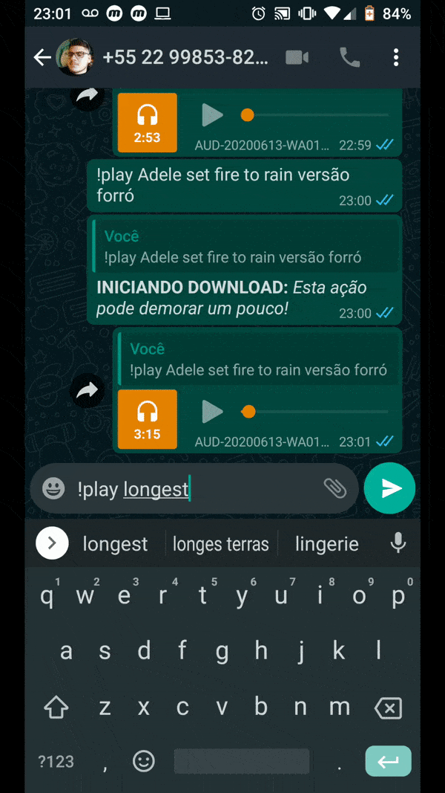
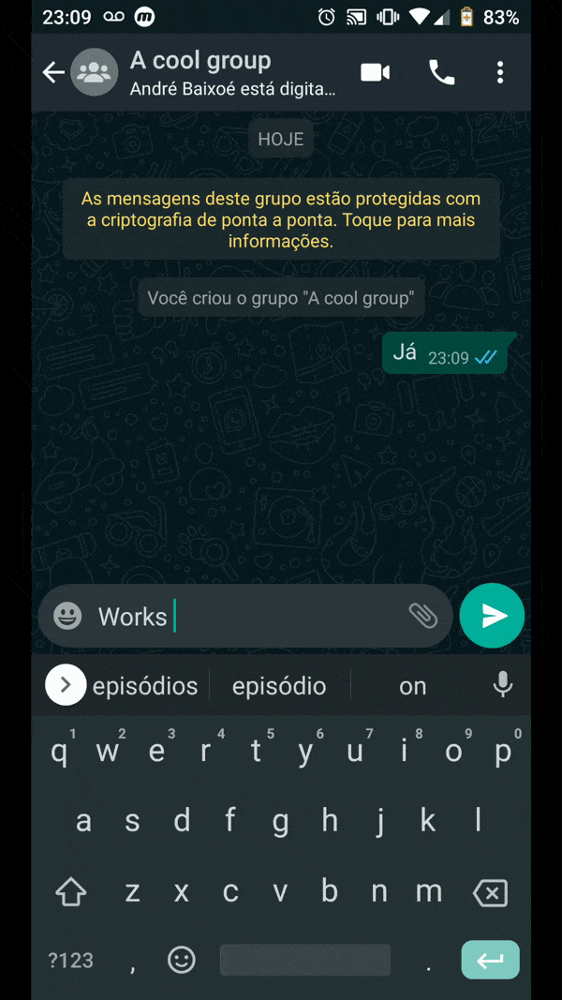
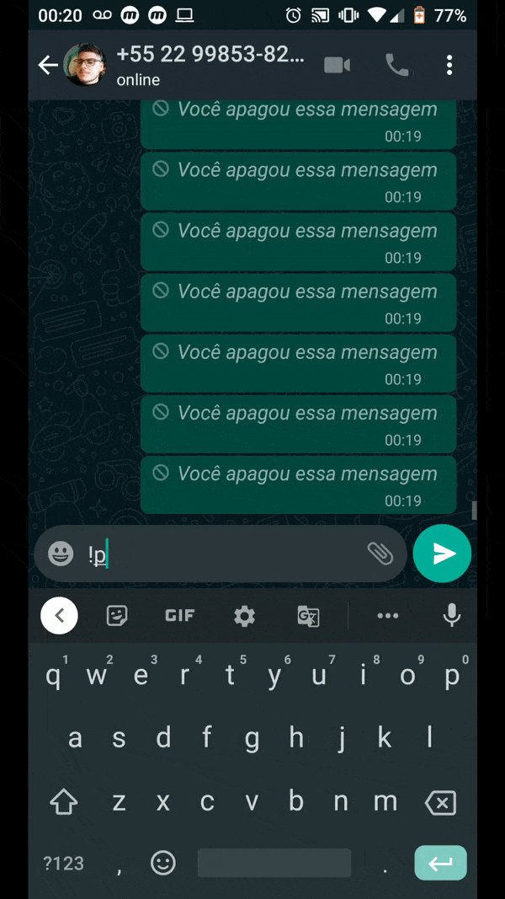

<h1 align="center">
  
</h1>

<h3 align="center">
  WhatsApp Music Bot v2
</h3>

<p align="center">
  

  

  
  <a href="https://github.com/mlg404/whatsapp-music-bot/commits/master">
    
  </a>

  <a href="https://github.com/mlg404/whatsapp-music-bot/issues">
    
  </a>

  
</p>

<p align="center">
  <a href="#rocket-info">Info</a>&nbsp;&nbsp;&nbsp;|&nbsp;&nbsp;&nbsp;
  <a href="#computer-technologies">Technologies</a>&nbsp;&nbsp;&nbsp;|&nbsp;&nbsp;&nbsp;
  <a href="#information_source-how-to">How to</a>&nbsp;&nbsp;&nbsp;|&nbsp;&nbsp;&nbsp;
  <a href="#mag_right-functionalities">Functionalities</a>&nbsp;&nbsp;&nbsp;|&nbsp;&nbsp;&nbsp;
  <a href="#busts_in_silhouette-contribute">Contribute</a>&nbsp;&nbsp;&nbsp;|&nbsp;&nbsp;&nbsp;
  <a href="#memo-license">License</a>
</p>

<p align="center" style="display: flex; align-items: center; justify-content:center;">
  
  
  
  
  
</p>

## :rocket: Info

Your whatsapp becomes a music bot!. You can send music's to your friend's private conversation or in your gropus just sending `!play SONG_NAME` where SONG_NAME is the name of the song you are looking for!

## :computer: Technologies

This project was developed following this technologies:

- [eslint](https://eslint.org/)
- [FFMPEG](https://ffmpeg.org/)
- [Node.js](https://nodejs.org/en/)
- [VS Code][vc]
- [Prettier](https://prettier.io/)
- [Typescript](https://www.typescriptlang.org/)
- [YouTube Search](https://www.npmjs.com/package/yt-search)
- [QrCode Terminal](https://www.npmjs.com/package/qrcode-terminal)
- [Whatsapp WEB js](https://pedroslopez.me/whatsapp-web.js/)
- [YouTube Downloader](https://www.npmjs.com/package/yt-dl-playlist)


## :information_source: How To

To clone this application you will need [Git](https://git-scm.com) + [Node.js v12.15.0][nodejs] or higher + [Yarn v1.22.4][yarn] or higher installed in your computer. Run in terminal:

```bash
# Clone this repo
$ git clone https://github.com/mlg404/whatsapp-music-bot.git whatsapp-music-bot

# Access this repo
$ cd whatsapp-music-bot

# Install dependencies with yarn
$ yarn install

# Run the application with yarn (or npm run dev)
$ yarn start
```

You need to configure your `ffmpegPath`. Remeber to previously download and instal ffmpeg (for convertions).

After run the script, you need to scan the QrCode in your terminal with your whatsapp! (Same proccess to join whatsapp web)

## :mag_right: Functionalities

See the current features!
- Search a song directly from youtube;
- Song's searched are downloaded for optimize next searches;
- Send song's in private or group's;
- Your friend's can send the command too;
- You can enable the "Download progress";
- Prevent download videos with mora than 15 minutes

## :busts_in_silhouette: Contribute

- Fork this repository;
- Create one branch with your feature: `git checkout -b my-feature`;
- Commit your alterations: `git commit -m 'feat: My new feature'`;
- Push to your branch: `git push origin my-feature`.

Open a pull request with your branch. After yout pull request merge, you should delete your branch.

## :memo: License
This project is under MIT license. See [LICENSE](https://github.com/mlg404/whatsapp-music-bot/blob/master/LICENSE) for more information.

---

Made with 💙 by Victor Eyer :wave: [Get in touch!](https://www.linkedin.com/in/victoreyer/)

[nodejs]: https://nodejs.org/
[yarn]: https://classic.yarnpkg.com/lang/en/
[vc]: https://code.visualstudio.com/
